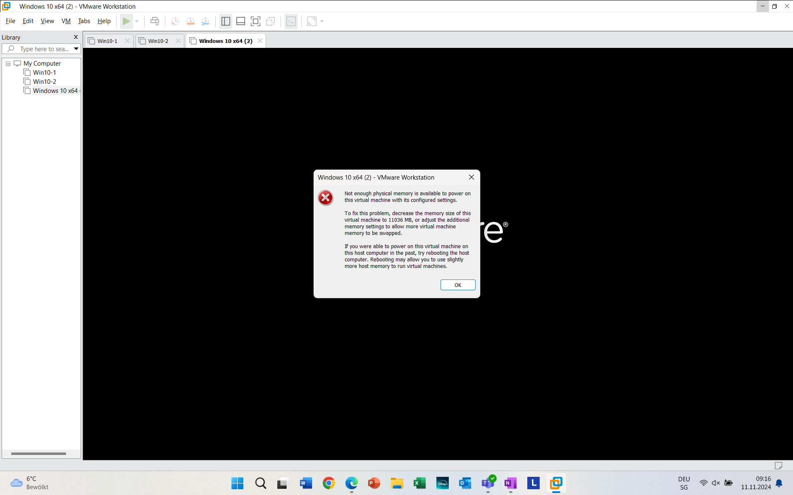
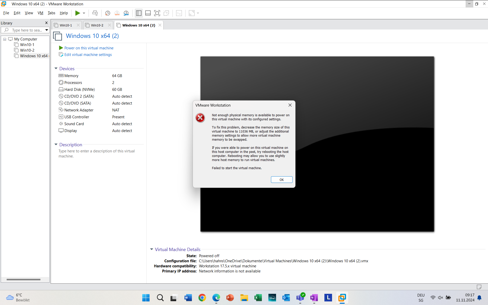

# 1. Hypervisor

Ein Hypervisor ist ein Virtual Machine Monitor. Dies ist eine Software, die es ermöglicht, mehrere virtuelle Maschinen (VMs) gleichzeitig auf einer einzigen Hardware auszuführen. Es gibt zwei verschiedene Typen von Hypervisoren:

### Hypervisor Typ 1 (Bare Metal Hypervisor)
Diese Art von Hypervisor läuft direkt auf der Hardware, ohne ein darunterliegendes Betriebssystem. Dadurch hat er besseren Zugriff auf die Hardware und bietet eine höhere Leistung.

### Hypervisor Typ 2 (Hosted Hypervisor)
Ein Hypervisor Typ 2 wird auf einem bestehenden Betriebssystem installiert und läuft als Anwendung. Dieser Typ von Hypervisor greift über das Host-Betriebssystem auf die Hardware zu.

Der Hauptunterschied zwischen den beiden Arten liegt also in der Architektur.

---

# 2. Vermutung zum verwendeten Hypervisor

Ich vermute, dass ich einen Hypervisor Typ 2 benutze, da ich ein Betriebssystem im Hintergrund habe (Windows) und die VM-Software auf diesem Betriebssystem installiert ist.

---

# 3. Fehlermeldungen und Analyse

Die Fehlermeldungen erscheinen, weil ich entweder zu viel RAM oder zu viele Prozessoren für die VM zugewiesen habe. Da meine VM auf einem Hypervisor Typ 2 basiert, ist sie mit dem Betriebssystem des Hosts verbunden. Dadurch kann die VM nicht gestartet werden, wenn das Host-System nicht genügend Ressourcen zur Verfügung stellt.
