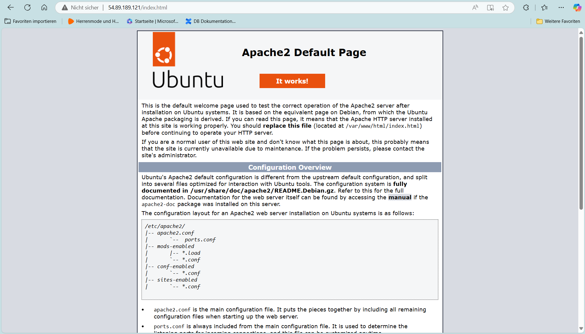
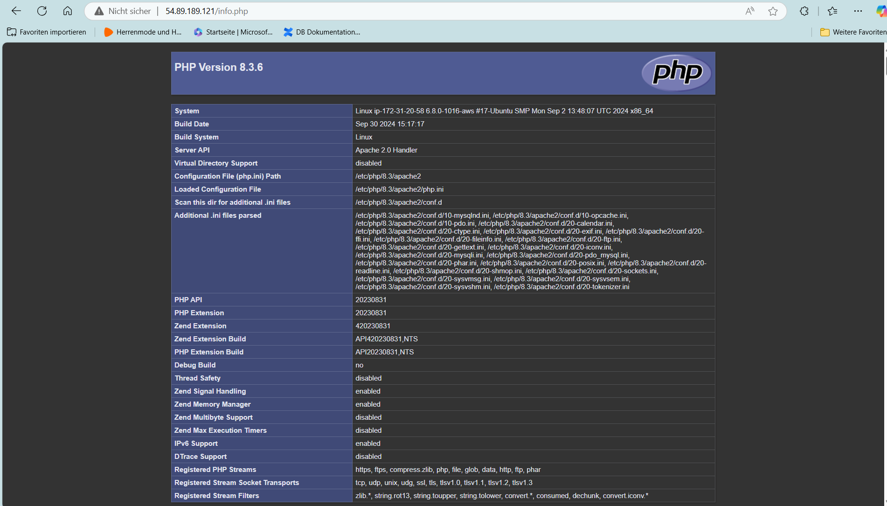
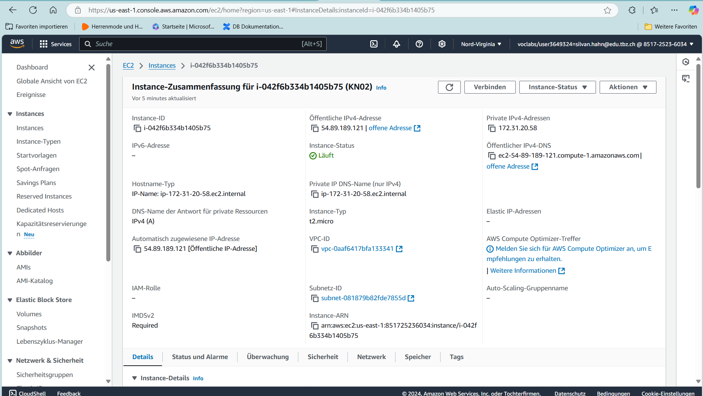
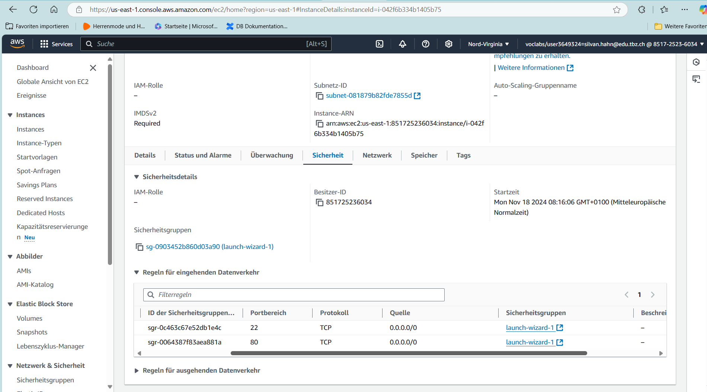
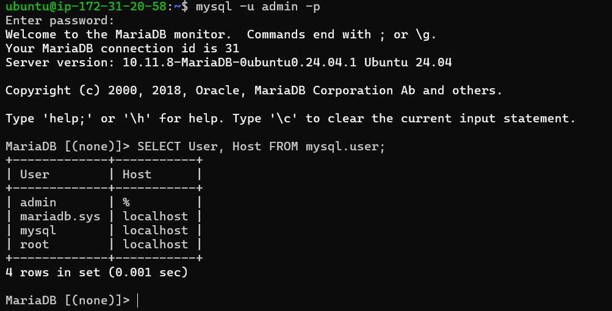

# Abgabe

## Screenshots
1. **Webseiten mit sichtbarer URL**  
   

2. **Webseiten mit sichtbarer URL**  
   

3. **Details der Instanz mit sichtbarer öffentlicher IP**  
   

4. **Regeln der Sicherheitsgruppe**  
     

5. **Abfrageergebnis in MySQL-Konsole**  
   

---

## Erklärung der Abfrage

Die Abfrage, die in der `db.php`-Datei verwendet wird, ruft die Benutzerinformationen der MySQL-Datenbank ab. Dies erfolgt mithilfe des folgenden SQL-Befehls:

```sql
SELECT User, Host FROM mysql.user;
