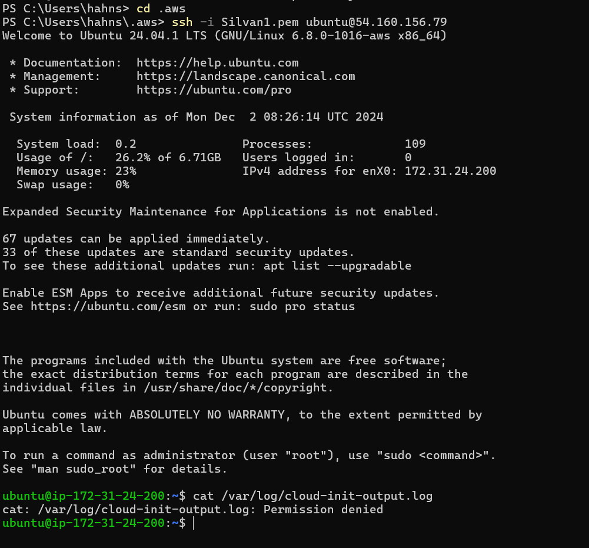
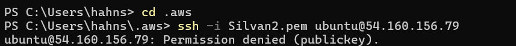
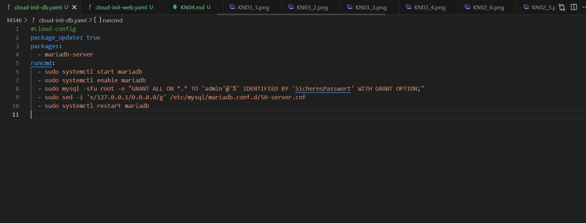
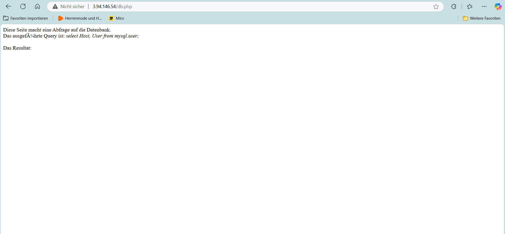
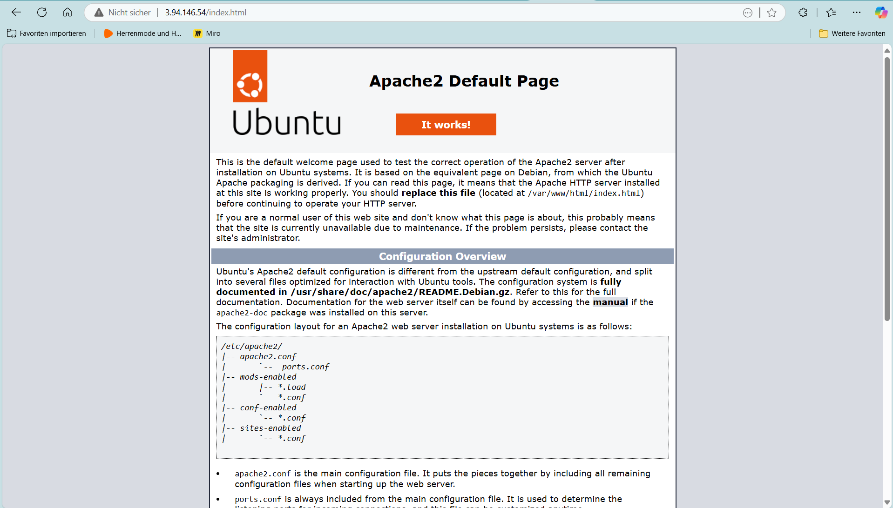
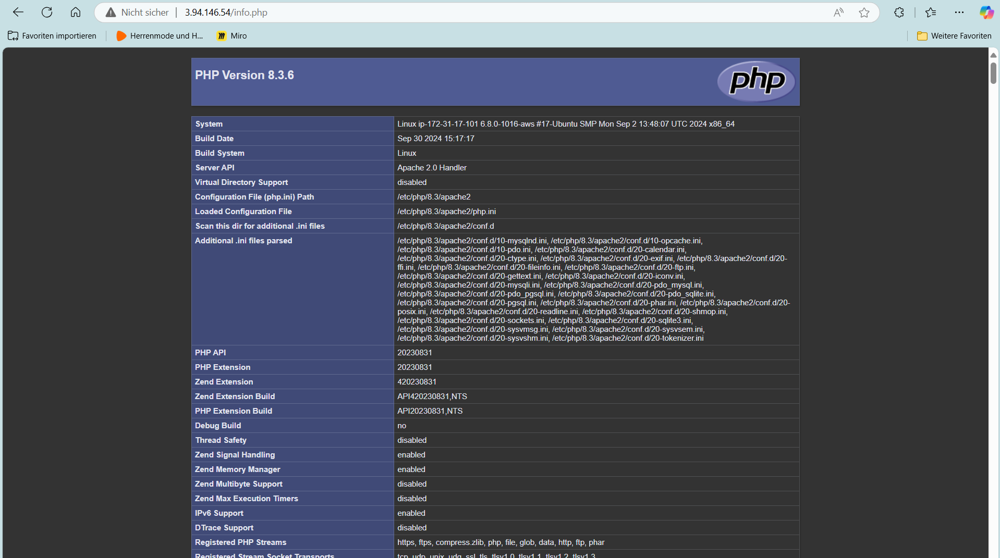
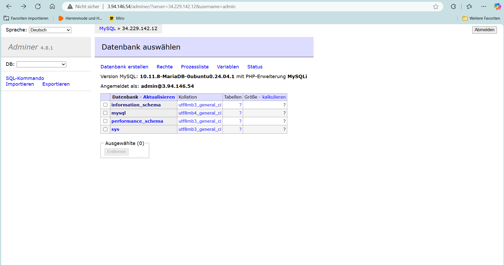

# Cloud-Init Automation and YAML Learning

## Overview

This project focuses on automating server installations using **Cloud-Init** and understanding the **YAML** syntax. It also involves troubleshooting, creating SSH keys, and setting up web and database servers that communicate with each other.

---

## Learning Objectives

1. **Understanding YAML Syntax:**
   - Learn how to write and interpret YAML files.
   - Familiarize with the syntax of Cloud-Init configurations.

2. **Automating Server Setup:**
   - Automate the installation and configuration of servers using Cloud-Init.
   - Split services across multiple instances (web server and database server).

3. **Key Pair Management:**
   - Understand SSH public/private key pairs.
   - Use Cloud-Init to add SSH keys for secure access.

4. **Troubleshooting and Logging:**
   - Learn how to troubleshoot using Cloud-Init logs located at `/var/log/cloud-init-output.log`.

---

## Steps Completed

### Part A: Understanding Cloud-Init and YAML
- Explored the **Cloud-Init** YAML format.
- Documented the purpose of each line in the provided Cloud-Init file.

**Deliverables:**
- The annotated YAML file is stored in the Git repository (not included here).

---

### Part B: SSH Key and Cloud-Init Integration
1. **SSH Key Creation:**
   - Generated SSH key pairs (`Silvan1.pem` and `Silvan2.pem`) for authentication.
   - Extracted the public keys from the private keys.
   - Configured the public key in Cloud-Init to allow access with `Silvan1.pem`.

2. **AWS Instance Setup:**
   - Created an AWS EC2 instance with **Ubuntu 24.04** and attached `Silvan2.pem` via the GUI.
   - Added `Silvan1.pem` to the Cloud-Init configuration.

3. **Verification:**
   - Successfully logged in using `Silvan1.pem`.
   - Failed to log in using `Silvan2.pem`.

4. **Log Inspection:**
   - Retrieved and analyzed the Cloud-Init logs (`/var/log/cloud-init-output.log`).

**Deliverables:**
- Screenshots of:
  - Instance details showing "Key pair assigned at launch."
  - Successful and failed SSH logins.
  - Cloud-Init logs.

  
  

---

### Part C: Cloud-Init Template
- Created a reusable Cloud-Init template including:
  - The student’s SSH public key.
  - The teacher's SSH public key for future accessibility.
- This template will be used for all upcoming Cloud-Init configurations.

---

### Part D: Automated Installation on Web and Database Servers

#### Database Server (cloud-init-db.yaml)
1. **Configuration:**
   - Installed MariaDB and configured it to allow external connections.
   - Modified `/etc/mysql/mariadb.conf.d/50-server.cnf` to replace `127.0.0.1` with `0.0.0.0`.

2. **Verification:**
   - Displayed the configuration file to verify the changes.

**Deliverables:**
- Cloud-Init YAML file (cloud-init-db.yaml).
- Screenshot of the modified configuration.

---

#### Web Server (cloud-init-web.yaml)
1. **Configuration:**
   - Installed Apache and PHP.
   - Deployed files (`index.html`, `info.php`, and `db.php`) using the `write_files` directive.
   - Installed and configured Adminer for database management.
   - Restarted the Apache service.

2. **Verification:**
   - Accessed the web pages and verified functionality.
   - Connected to the database server using Adminer.

**Deliverables:**
- Cloud-Init YAML file (cloud-init-web.yaml).
- Screenshots of:
  - `index.html`, `info.php`, and `db.php` web pages.
  - Adminer showing a successful connection to the database.

  

---

## Common Issues and Solutions

1. **YAML Formatting Errors:**
   - Ensure proper indentation and validate using [YAML Lint](https://www.yamllint.com/).

2. **SSH Key Issues:**
   - Use the correct format: `ssh-rsa <public-key> aws-key`.

3. **Database Connection Issues:**
   - Verify the database is running using `mysql -u admin -p`.
   - Test connectivity from the web server using `telnet <DB-IP> 3306`.

4. **Cloud-Init Log Analysis:**
   - Check `/var/log/cloud-init-output.log` for errors during instance setup.

---

## References

- [Cloud-Init Documentation](https://cloudinit.readthedocs.io/)
- [YAML Lint Validator](https://www.yamllint.com/)
- [AWS EC2 User Guide](https://docs.aws.amazon.com/ec2/)

---
