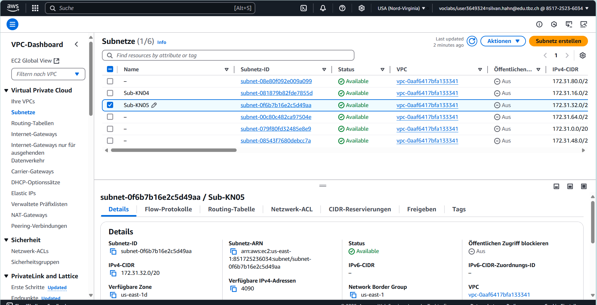
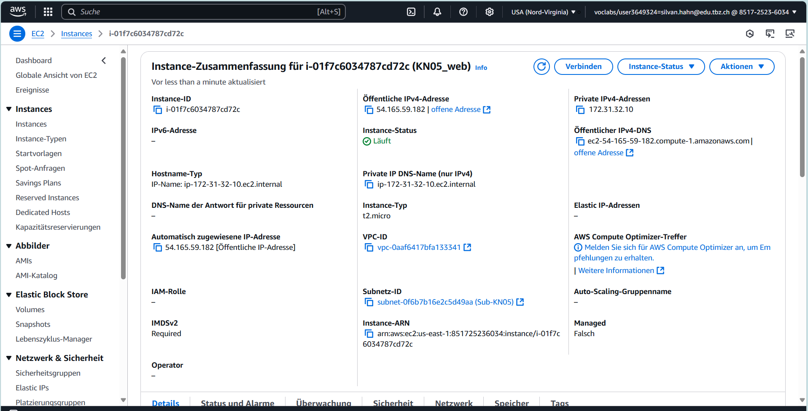
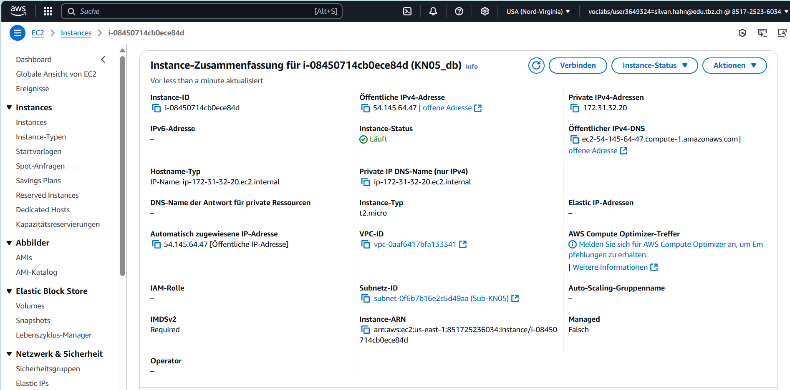
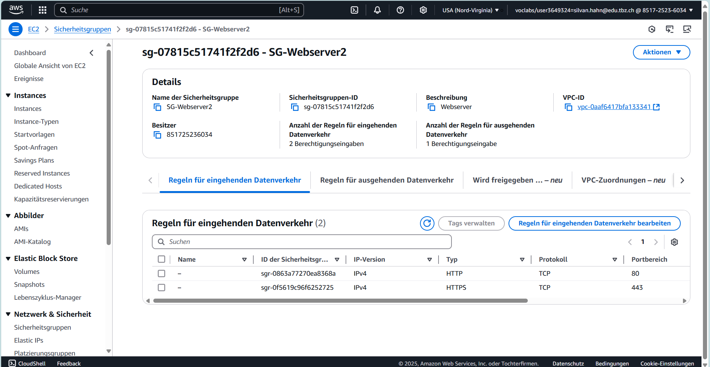
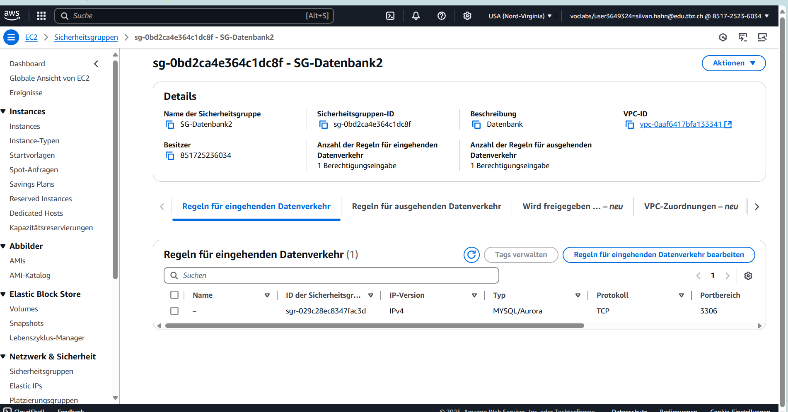

# AWS-Aufgabe: VPC und Subnetze planen

## 1. Begriffe erklären
### Was ist eine VPC (Virtual Private Cloud)?
Eine VPC ist ein virtuelles Netzwerk, das in der AWS-Cloud eingerichtet wird. Es erlaubt dir, Ressourcen wie EC2-Instanzen isoliert in einer sicheren Umgebung zu betreiben. Du kannst eigene IP-Bereiche, Subnetze, Routing-Tabellen und Gateways festlegen.

### Was ist ein Subnetz?
Ein Subnetz ist ein Teilbereich eines VPC, der den IP-Adressbereich in kleinere Segmente unterteilt. Subnetze dienen zur besseren Organisation und Segmentierung von Ressourcen. Ein Subnetz kann entweder privat (ohne direkten Zugang zum Internet) oder öffentlich (mit Internet-Gateway) sein.

---

## 2. Vordefinierte Subnetze und IP-Ranges
### Wie viele Subnetze sind vordefiniert?
In der AWS-Konsole sind **6 Subnetze** in der VPC vorhanden.

### Decken die IP-Bereiche der Subnetze den gesamten Bereich der VPC ab?
Die VPC hat den IP-Bereich **172.31.0.0/16**. Die Subnetze haben verschiedene Bereiche, z. B.:
- 172.31.80.0/20
- 172.31.16.0/20
- 172.31.32.0/20
- 172.31.64.0/20
- 172.31.0.0/20
- 172.31.48.0/20

Die IP-Bereiche der Subnetze decken den gesamten IP-Bereich der VPC ab.

---

## 3. Öffentliche und private IPs
### Unterschied zwischen öffentlicher und privater IP:
- **Öffentliche IP**: Diese IP-Adresse ist global erreichbar und ermöglicht den Zugriff aus dem Internet auf die Instanz.
- **Private IP**: Diese IP-Adresse ist nur innerhalb der VPC oder des internen Netzwerks erreichbar. Sie wird verwendet, um Ressourcen miteinander zu verbinden (z. B. Webserver mit Datenbank).

### Was ist eine statische IP?
Eine statische IP ist eine feste IP-Adresse, die sich nicht ändert, auch wenn die Instanz neu gestartet wird. In AWS wird eine statische IP als Elastic IP bezeichnet.

---
### Abgabe A

---

### Abgabe B

