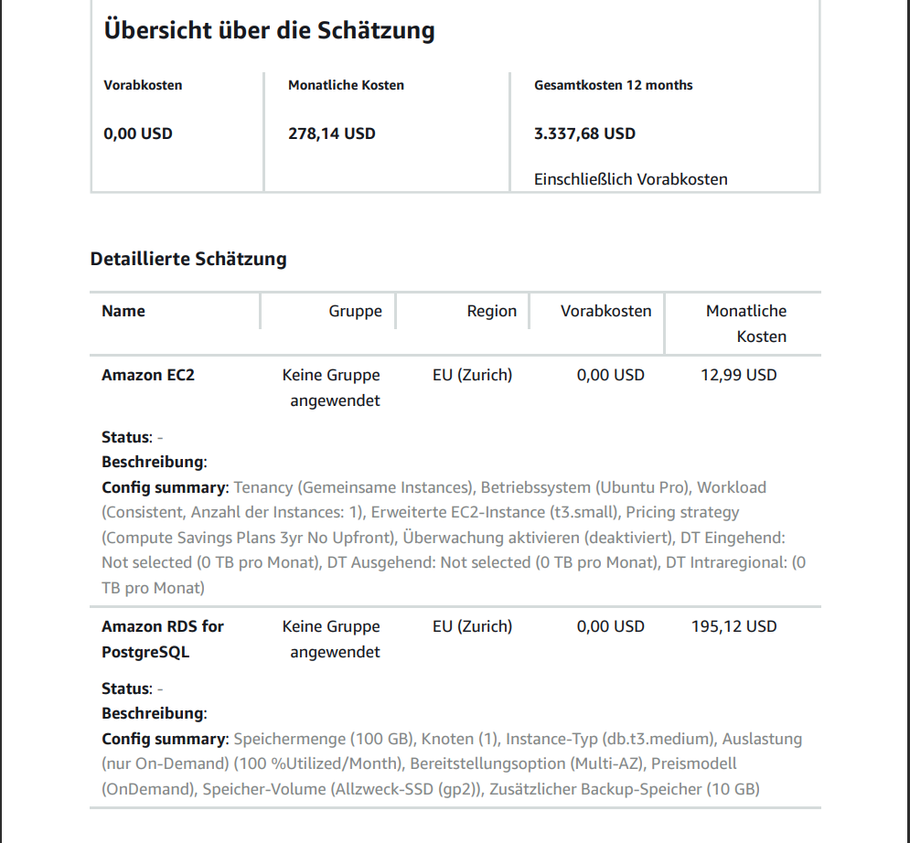
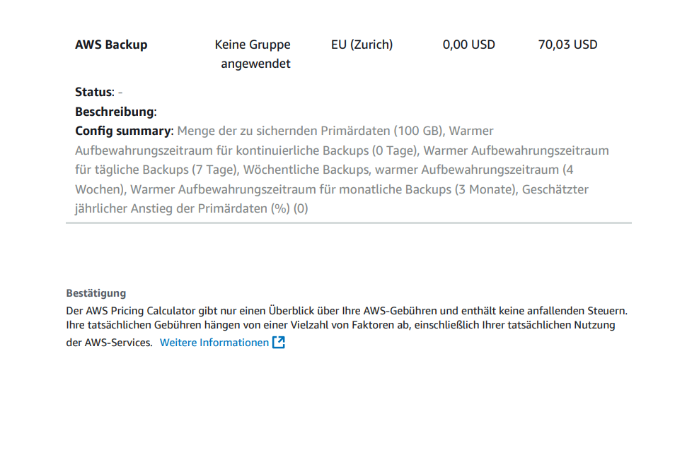
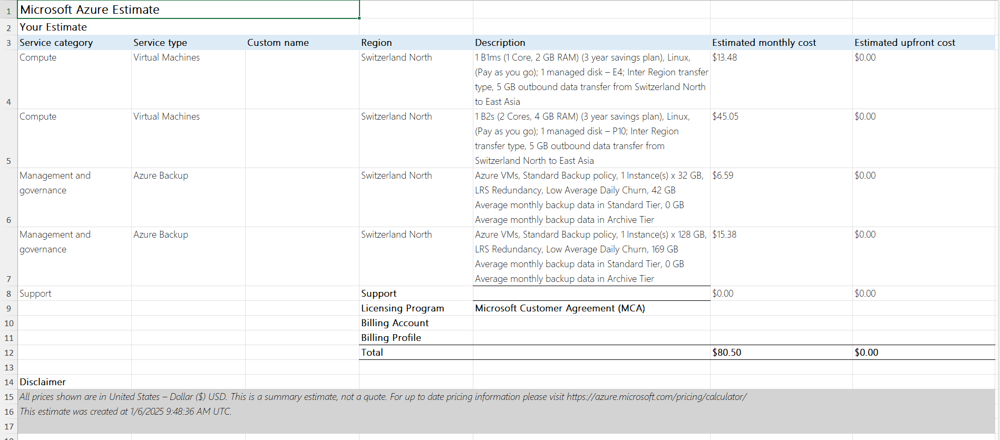
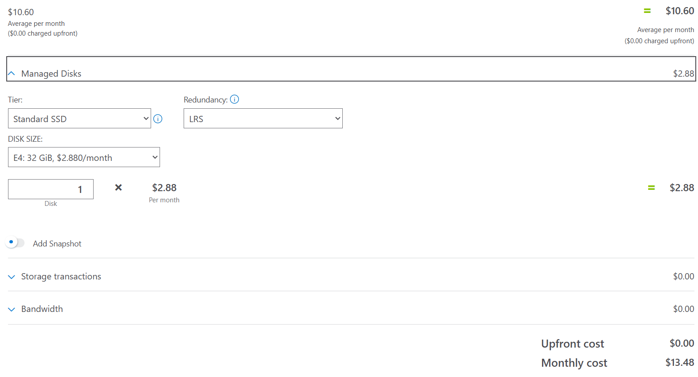
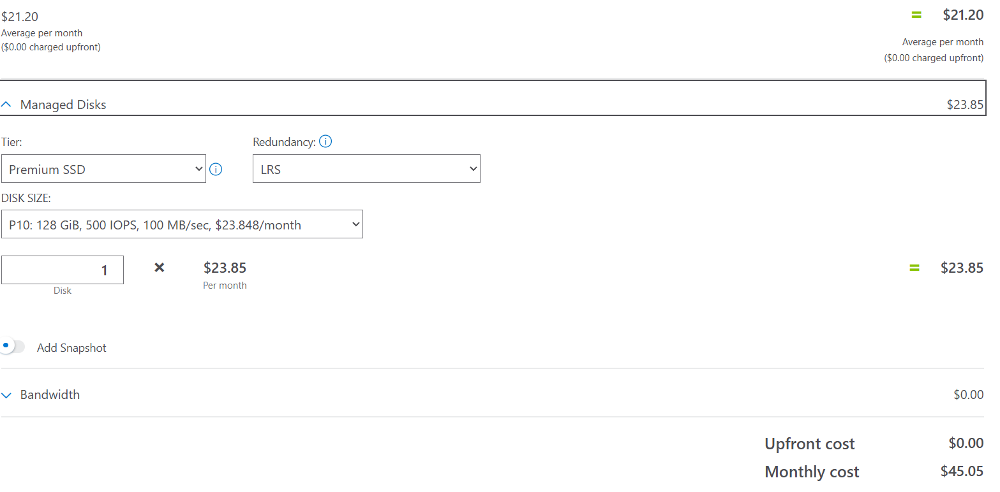
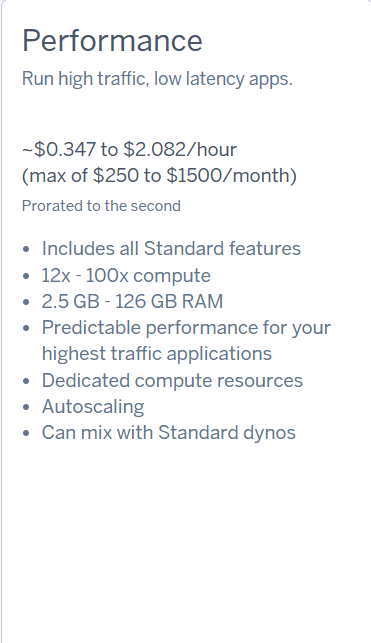
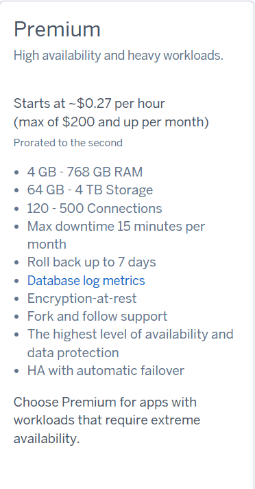
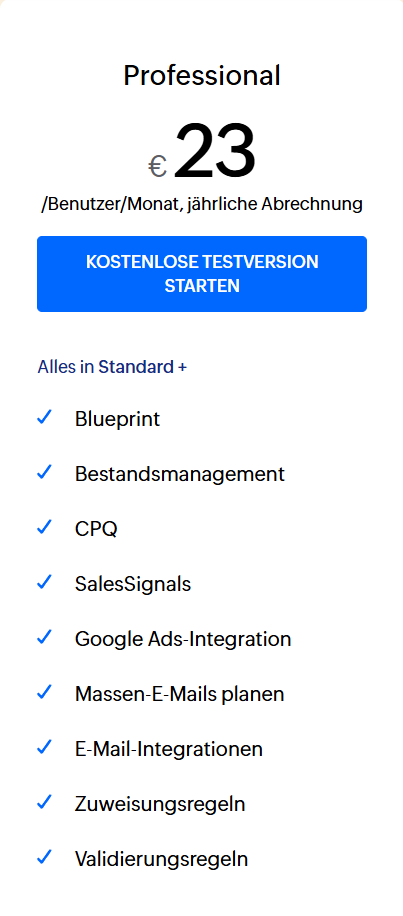
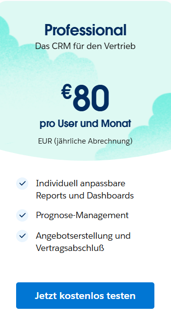

# **Kostenrechnung und Begründung für Rehosting (IaaS)**

## **1. AWS IaaS Kostenrechnung**

### **Zusammenfassung**
- **Exportdatum:** 6. Januar 2025
- **Monatliche Kosten:** $278.14
- **Jahreskosten:** $3,337.68
- **Vorabkosten:** $0.00

### **Details**
#### **Web Server**
- **Instance Typ:** `t3.small` (1 Core, 2 GB RAM)
- **Betriebssystem:** Ubuntu Pro
- **Pricing Strategie:** Compute Savings Plans (3 Jahre, Keine Vorabkosten)
- **Monatliche Kosten:** $12.99

#### **Datenbank Server**
- **Instance Typ:** `db.t3.medium` (2 Cores, 4 GB RAM)
- **Multi-AZ Deployment**
- **Speicher:** 100 GB (Allzweck-SSD - gp2)
- **Monatliche Kosten:** $195.12

#### **Backup**
- **Primärdaten:** 100 GB
- **Backup-Aufbewahrung:**
  - Tägliche Backups für 7 Tage
  - Wöchentliche Backups für 4 Wochen
  - Monatliche Backups für 3 Monate
- **Monatliche Kosten:** $70.03

### **Screenshots**
- **Zusammenfassung AWS IaaS**  
    
  

### **Begründung**
- Die ausgewählten Konfigurationen entsprechen weitgehend der aktuellen **On-Premise-Infrastruktur** und nutzen gleichzeitig die Vorteile der Cloud.
- **Web Server:**
  - Die `t3.small` Instanz mit 1 Core und 2 GB RAM erfüllt die Anforderungen und bietet durch das Savings Plan-Modell Kosteneffizienz.
- **Datenbank Server:**
  - Die `db.t3.medium` Instanz unterstützt 2 Cores und 4 GB RAM, was der On-Premise-Konfiguration entspricht.
  - Multi-AZ Deployment stellt hohe Verfügbarkeit und Datenhaltbarkeit sicher.
- **Backup:**
  - Der AWS Backup Service ist so konfiguriert, dass er die spezifizierte Aufbewahrungsrichtlinie erfüllt und dabei die Kosten optimiert.

---

## **2. Azure IaaS Kostenrechnung**

### **Zusammenfassung**
- **Monatliche Kosten:** $80.50
- **Vorabkosten:** $0.00

### **Details**
#### **Web Server**
- **Instance Typ:** `B1ms` (1 Core, 2 GB RAM)
- **Region:** Schweiz Nord (Switzerland North)
- **Speicher:** Managed Disk (E4 - 32 GB)
- **Savings Plan:** 3 Jahre (Pay-as-you-go)
- **Monatliche Kosten:** $13.48

#### **Datenbank Server**
- **Instance Typ:** `B2s` (2 Cores, 4 GB RAM)
- **Region:** Schweiz Nord (Switzerland North)
- **Speicher:** Managed Disk (P10 - 128 GB)
- **Savings Plan:** 3 Jahre (Pay-as-you-go)
- **Monatliche Kosten:** $45.05

#### **Backup**
- **Web Server Backup:**
  - **Speicher:** 32 GB
  - **Backup-Aufbewahrung:** Entspricht AWS
  - **Monatliche Kosten:** $6.59
- **Datenbank Backup:**
  - **Speicher:** 128 GB
  - **Backup-Aufbewahrung:** Entspricht AWS
  - **Monatliche Kosten:** $15.38

### **Screenshots**
- **Zusammenfassung Azure IaaS**  
    
- **Details Webserver Azure**  
    
- **Details Datenbankserver Azure**  
  

### **Begründung**
- **Web Server:**
  - Die `B1ms` Instanz mit 1 Core und 2 GB RAM erfüllt die Anforderungen und ist kostengünstig für die CRM-Anwendung.
- **Datenbank Server:**
  - Die `B2s` Instanz bietet die benötigten 2 Cores und 4 GB RAM und unterstützt die Datenbankanforderungen effizient.
- **Backup:**
  - Azure Backup wurde so konfiguriert, dass es der gleichen Aufbewahrungsrichtlinie wie AWS entspricht und gleichzeitig wettbewerbsfähige Preise nutzt.

---

## **3. Vergleich und Auswahl der Konfigurationen**

| **Kriterium**       | **AWS**               | **Azure**              | **Begründung für die Auswahl**                                                            |
|----------------------|-----------------------|------------------------|------------------------------------------------------------------------------------------|
| **Web Server**       | `t3.small` (1 Core)  | `B1ms` (1 Core)        | Beide Konfigurationen erfüllen die Anforderungen (1 Core, 2 GB RAM).                     |
| **Datenbank Server** | `db.t3.medium`       | `B2s`                  | Liefert 2 Cores und 4 GB RAM, wie die On-Premise-Anforderungen.                          |
| **Backup**           | AWS Backup           | Azure Backup           | Konfiguration entspricht der definierten Aufbewahrungsrichtlinie.                        |
| **Kosten**           | $278.14/Monat        | $80.50/Monat           | Azure ist aufgrund der wettbewerbsfähigen Preise in der Region Schweiz Nord günstiger.    |

---

## **Fazit**
- **Azure** bietet die kostengünstigste Lösung für das Rehosting-Modell mit Gesamtbetriebskosten von $80.50 pro Monat im Vergleich zu $278.14 pro Monat bei AWS.
- Die ausgewählten Konfigurationen entsprechen der On-Premise-Infrastruktur und bieten die nötige Flexibilität und Skalierbarkeit der Cloud.

---

### **B) Kostenrechnung PAAS - Replattforming**

#### **Heroku Konfiguration und Kosten**
- **Web Server**: Standard-2X Dyno (2 Cores, 1 GB RAM)
- **Datenbank**: PostgreSQL Standard 4 (4 GB RAM, 100 GB Speicher)
- **Backup**: Inklusive

**Schätzung:**
- Web Server: $50/Monat
- Datenbank: $100/Monat
- Gesamt: $150/Monat

#### **Begründung**
Die Konfiguration erfüllt die Anforderungen der On-Premise-Infrastruktur. Heroku bietet automatische Skalierung und Managed Services, was den operativen Aufwand deutlich reduziert.

### **C) Kostenrechnung SAAS - Repurchasing**

#### **Zoho CRM**
- **Plan**: Professional Plan
- **Kosten**: $20/Benutzer/Monat x 30 Benutzer = $600/Monat
- **Funktionen**: Automatisierung, Integration mit Drittanbietern, Workflow-Regeln.

#### **Salesforce Sales Cloud**
- **Plan**: Professional Plan
- **Kosten**: $75/Benutzer/Monat x 30 Benutzer = $2,250/Monat
- **Funktionen**: Erweitertes Reporting, Skalierbarkeit, hohe Flexibilität.

#### **Begründung**
Zoho CRM wird aufgrund des niedrigeren Preises und ausreichender Funktionen für kleine bis mittlere Unternehmen bevorzugt. Salesforce bietet mehr Funktionen, ist jedoch für diese Anwendung überdimensioniert.

### **D) Interpretation der Resultate**

#### **Kostenvergleich**
| **Lösung**      | **Monatliche Kosten** | **Begründung der Unterschiede**                                             |
|------------------|-----------------------|-----------------------------------------------------------------------------|
| **AWS IaaS**     | $278.14              | Höhere Kosten durch Multi-AZ, Backups und On-Demand-Ressourcen.             |
| **Azure IaaS**   | $80.50               | Niedrigere Kosten dank günstigem Pricing in der Schweiz Nord Region.        |
| **Heroku PAAS**  | $150.00              | Integrierte Verwaltung reduziert Betriebskosten.                            |
| **Zoho CRM**     | $600.00              | Kostengünstige Lösung für CRM mit ausreichend Funktionen.                   |
| **Salesforce**   | $2,250.00            | Premium-Lösung mit umfangreichen Funktionen und hohem Preis.                |

#### **Aufwand für Ihre Firma**
- **AWS und Azure (IaaS)**:
  - Hoher Migrationsaufwand (Setup, Konfiguration, Wartung).
  - Expertenwissen erforderlich.
- **Heroku (PAAS)**:
  - Mittlerer Aufwand (Web Server und Datenbanken verwaltet).
  - Geringerer Wartungsaufwand im Vergleich zu IaaS.
- **Zoho und Salesforce (SAAS)**:
  - Geringster Aufwand.
  - Keine Wartung erforderlich, schneller Einstieg möglich.
